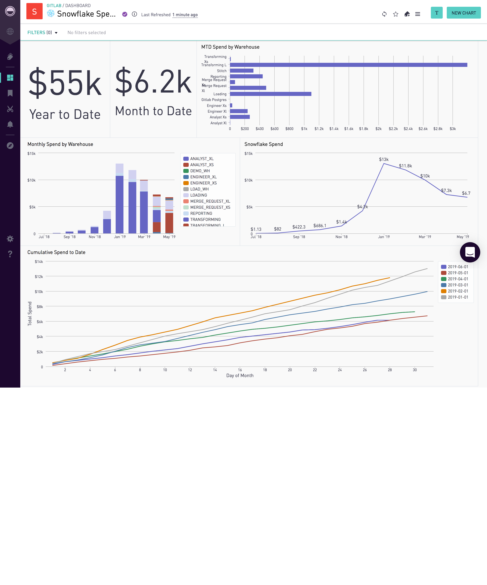

Below is the Periscope dashboard that the GitLab data team uses to monitor our Snowflake Spend.

The underlying queries are available in this folder.
When you run `dbt compile`, the `{ref('')}` statements will get populated with your schema and table name.

We welcome suggestions for improvement.

